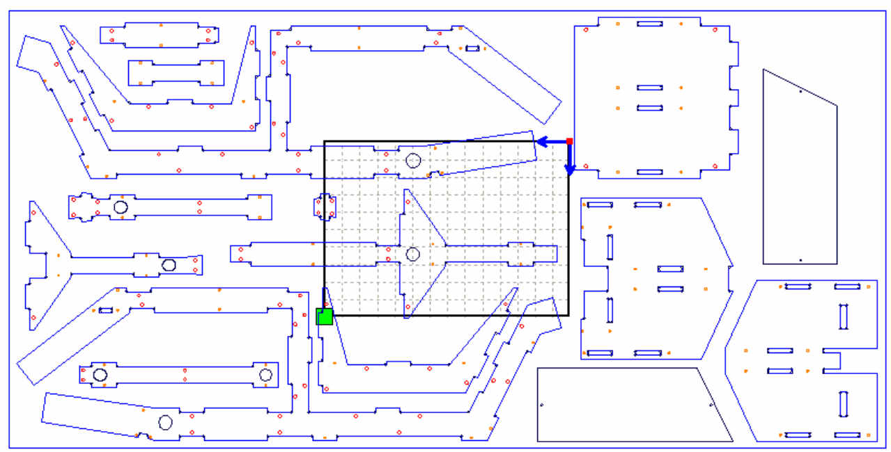
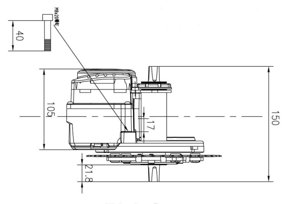

Réalisation d'un vélo cargo open-source électrifié
-----------------
velocargo-groupe1

# Contexte/roadmap:
1. Électrification  d'un vélo (en cours)
* Amélioration :
	* Réduire le cout en supprimant l'écran -> boutons i3d + LEDs de contrôle
	*	Contrôleur  esp32 du tsdz2 (appétence Victor ?)
	*	Flash projet tsdz2 open source
	*	Conception boutons assistance + leds pour statut batterie;
	* Utiliser uniquemEnt CAPTEUR de force du pédalier sur d'autres contrôleurs/moteurs

2. Remorque vélo à assistance (en cours)
* Besoins reverse engeneering moteurs roue Matra

3. Vélo cargo cadre bois open-source: électrification + qualification industrielle
* Préciser roadmap projet
* Recherches qualif industriel / existant : contrôle qualité

4. Longtail : lock technologique sur transmission adaptée roues de 20 pouces   
* Pistes :   
	*	Validité brevets rohloff ?
	*	brevet shimano boites de vitesse a pignons ?
  * En cours : impression à fin pédagogique [Modèle Gearbox Cults 3D](https://cults3d.com/en/3d-model/tool/formula-1-gearbox)

# Avantage du vélo par rapport à la voiture
- Plus économique qu’une voiture, en effet on estime qu’un trajet quotidien de 10 km à vélo coûte environ 100 euros contre 1000 euros pour la même distance, mais effectués en voiture (source : Ademe).
- Moins polluant qu’une voiture : Remplacer la voiture par le vélo est un acte concret pour combattre le réchauffement climatique. En effet, les voitures sont responsables de 15,7 % des émissions de gaz à effet de serre en France. Et même si un vélo électrique pollue un peu plus qu’un vélo classique, on estime que la voiture émet jusqu’à 12 fois plus de CO2 pour une même distance de parcours.
- Toujours selon l’Ademe, les transports à vélo sont en moyenne plus rapides en ville que les voitures. Plus rapide et plus pratique. En effet, moins de difficulté pour se garer, etc.
- Plus pratique pour courts et moyens trajets ! De plus, notre vélo est électrique donc pas de soucis en cas de pente. Enfin, notre vélo est particulièrement adapté à la vie citadine, car il est muni d’une capacité de stockage de 50 kilos grâce à la solidité du bois utilisé (bois contreplaqué), très pratique pour faire ses courses. Il sera également utile dans le milieu professionnel (on peut penser aux personnes travaillant chez Uber Eats etc.).
- Meilleur pour la santé du cycliste et pour la santé publique en général : Faire du vélo régulièrement permet bien sûr de pratiquer du sport ce qui est bon pour la santé mais pas seulement. En effet, plus il y a de voitures remplacées par des vélos, plus on limite l’émission de particules fines car il y a moins de voitures sur les routes !
- Les voitures sont une des premières sources de nuisance sonore dans les villes. En effet, on estime que le seuil de nuisance sonore est situé à partir de 80 dB. Et les voitures émettent un son situé 72 et 81 dB. C’est pourquoi, réduire le nombre de voitures en ville permettrait de rendre l’environnement citadin plus agréable.

# Guide dimensionnement vélo cargo 
Plan que nous avons utilisé :   

Lors d’un premier essai, nous avons découpé les pièces de notre vélo cargo grâce à la découpeuse laser.    
Nous avons choisi de petites dimensions afin que toutes les pièces rentrent sur une seule plaque de bois.
Cependant les trous qui permettent aux pièces de s’emboiter étaient trop petits.    
Le problème a été réglé en choisissant de plus grandes dimensions et en arrondissant les angles des pièces.    
Pour cela nous avons conservé les petits ronds en chaque coin (voir photo ci-dessous) à l’aide du logiciel RDWorksV8 de la découpeuse laser. En effet, nous les avions supprimés par erreur.   

Échelle 1/2.55 . On met le moteur en dessous du pédalier car suffisamment de marge en dessous par rapport au sol.   

Une échelle de 1/ 2.55 pour la réalisation de la maquette, la tentative d’impression 3D du moteur/pédalier (modélisés grossièrement) a été un échec, il faut la reprendre.    
Le but de cette impression était de visualiser les modifications à faire au niveau du châssis du vélo afin d’intégrer le moteur.

# Parties de vélo pour le vieux biclou:

* Composants divers (manivelle, boitier pédalier, levier de vitesses, frein à rétropédalage arrière, frein à disque hydraulique, roues, guidon, tige, selle, pédales, garde-boue.
* Boitier de pédalier
* Fourche avant, support de frein à disque et support pour direction.
* Tige de selle
* Releveur de tiges

# Test vélo
Pour vérifier la solidité du cadre, vous pouvez également freiner avec le frein avant puis le pousser avec des aller-retour en poussant via la selle.   
Il ne doit pas y avoir de jeu, ni au niveau de du cadre, ni au niveau de la fourche ou de la direction.   

Le premier roulement à vérifier est celui du jeu de direction.   
Pour se faire, soulevez la roue avant du vélo, une fois que celle-ci n’est plus en contact avec le sol faites tourner le guidon de droite à gauche.   
Avec des roulements en bon état, vous avez juste à pousser légèrement le guidon et celui-ci tourne complètement tout seul.   

Ensuite, il vous faut vérifier les roulements au niveau du pédalier.   
Pour ce faire, tenez la manivelle et faites un mouvement de va-et-vient vers l’extérieur, vous ne devez pas avoir de jeu.   

Il est préférable de vérifier régulièrement le serrage des différents éléments de votre vélo.   
Ce sont quelques gestes rapides, mais importants pour vous assurer que tout est en ordre sur votre vélo.   
 Vérifiez le serrage de :
* la selle et tige de selle
* la potence
* les roues (attaches rapides ou écrous)
* les leviers de freins
* les manivelles et les pédales
* les dérailleurs (vis de fixation)
* les accessoires (panier, porte-bagage, garde-boues, etc)
Profitez-en pour vérifier le bon alignement du guidon et la roue. Une fois le guidon positionné à 90° par rapport au cadre (position classique), la roue avant doit être parfaitement parallèle au cadre.

Effectuez également un contrôle visuel afin de vérifier l’état de votre cadre. Inspectez le cadre et la fourche afin de détecter toute fissure, notamment près des soudures.

# Sources

Plan vélo
* [Veit Penzenstadler - 📕 Open Source Carbo Bike Manual](https://veit-penzenstadler.de/wp-content/uploads/2018/09/opensourcecargobikemanual.pdf)
* [Veit Penzenstadler - Modèle 3D (Gradcad) ](https://grabcad.com/library/open-source-cargo-bike-1)

Pour l'éléctrification
* https://github.com/OpenSourceEBike/TSDZ2-Smart-EBike

Frachtstück
* [Site Web Frachstück](https://veit-penzenstadler.de/frachtstueck/)
* [Dropbox Frachtstück](https://www.dropbox.com/sh/int6hpsbvspp111/AADPumKs_Pte9Y-qZoc3wGsea?dl=0&lst=)
